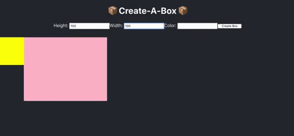

# React Boxmaker

Practice working with React forms. 

#### Create a new React application, which contains the following components:

* App - this component should render the BoxList component.
* BoxList - Place your state that contains all of the boxes here. This component should render all of the Box components along with the NewBoxForm component
* Box- this component should display a div with a background color, width and height based on the props passed to it.
* NewBoxForm - this component should render a form that when submitted, creates a new Box. You should be able to specify the Box’s width, height, and background color. When the form is submitted, clear the input values.
* When each Box component is displayed, add a button with the text of of “X” next to each Box. When this button is clicked, remove that specific box. This will require you to pass a function down as props - the button should not be a seperate component, it should be included in the Box component.

## My Finished Project

### What I've Learned

* evt.prentDefault() stops the default page reload of a form
* How to handle multiple inputs with one function, rather than a function per input on a form. 
* How vital it is to understand how to iterate over data and access the needed information for the application. 
* htmlFor is used for the label to connect to the id of the input.
* React key is only for react. The key cannot be used as an identifier for manipulation with functions. 

:thumbsup: *Thanks for checking out my work on GitHub! For more about me find me on Twitter [@TyeDev](https://twitter.com/tyedev) or visit my personal website [TyeCampbell.com](www.TyeCampbell.com).*
